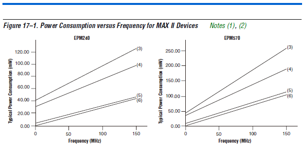
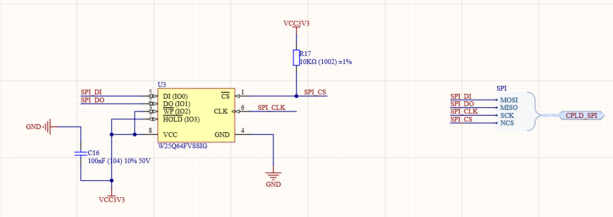

# MAXII 核心板信息

## 1. 核心板背景与简介

数字电路是任何想要从事EE专业（电子工程专业）和CE专业（计算机工程专业）的基础学科，尤其是近几年物联网、大数据和人工智能的崛起，吸引了大批的人员进入的EE和CE的专业领域。

而传统的高校教学中往往偏于基础原理的讲解，学生在学习枯燥和抽象理论的过程中，如果不结合实践，所学的知识往往都是纸上谈兵。很多人开始带着很高的热情进入这个专业学习，时间一久，遇到的问题越积越多，就慢慢丧失了兴趣。因此，越来越多的高校在进行理论教学的同时，增加了实验性的教学和课程设计等。让学生在边学习理论知识的同时，通过实践，了解接触甚至亲自动手设计理论教学中的实物（实验器材、课程设计）等，这样增加了趣味性，学生带着实践过程中遇到的问题听课，往往会收到更好的学习效果。

笔者当初在本科二年级（2011年）有幸进入学校——陕西科技大学电气与信息工程学院（现在更名为电子信息与人工智能学院）张俊涛教授管理的开放实验室进行学习，在实验室得到了老师和学长们的指导，才能找到在电子工程行业的研发工作，并且在这个行业深耕至此。

一直想为学校的发展做些力所能及的贡献，而想到自己过去走过的弯路，想要与学弟以及其他想要进入EE和CE专业的人分享一些自己浅薄的经验。

所以开始设计了MAX II系列的核心板，希望能够让读者了解数字电路以及FPGA/CPLD的原理，将所学的理论知识与实践相结合。最终在日后的学习和工作中，少走弯路，设计更稳定的电路，完成更完美的产品。

CPLD的全称为Complex Programable Logic Device ——复杂可编程逻辑器件。它把乘积技术和EEPROM存储工艺结合到一起，内部延时固定，用以实现复杂组合逻辑电路。

FPGA的全称Field－Programmable Gate Array——现场可编程门阵列，是在CPLD等可编程器件基础上进一步发展的产物。

（后面会增加CPLD与FPGA对比的文章进行介绍）

MAX II系列作为早期Altera公司（现已被Intel收购）的经典产品之一，主要特性如下：

**1.1 低功耗 **

**1.2 低成本**

**1.3 高性能**

**1.4 独特特性**

**1.5 实时在线可编程能力（ISP)**

**1.6 灵活的多核电压**

**1.7 丰富的I/O接口**

**1.8 使用方便的软件**

## 2. 设计需求研究与分析

对于入门级的数字电路学习和设计人员，CPLD相对FPGA而言，无论在电源设计还是工作 配置等方便，都更加简单便捷。

对于MAX II系列具有较高性价比的芯片是EPM240T100C5N和EPM570T100C5N，两款芯片在绝大多数引脚功能上相同，数量也想通，从而使得设计一款兼容两种芯片的核心板成为可能。二者的差别也主要是在内部逻辑资源数量上的差别。

MAX II系列主要特征表（MAX II Device Handbook - MII5V1-3.1  **Table 1–5. MAX II External Supply Voltages** ）：

部分设计主要参考手册——官网

[**2.1 MAX II CPLD Design Guidelines**](https://www.intel.cn/content/dam/www/programmable/us/en/pdfs/literature/an/an428.pdf)

[**2.2 MAX II Device Handbook**](https://www.intel.cn/content/dam/www/programmable/us/en/pdfs/literature/hb/max2/max2_mii5v1.pdf)

**[2.3 MAX II和MAX CPLD设计实例](https://www.intel.cn/content/www/cn/zh/programmable/support/support-resources/operation-and-testing/exm-max.html)**

**具体设计步骤：**

1）考虑CPLD的工作电压

设计中采用EPM240T100C5N和EPM570T100C5N,因此需要对两种芯片进行部分引脚的兼容性设计。详细参考原理图。

手册Inctrduction的feature部分指出，MAX II系列多电平内核支持3.3V,2.5V和1.8V （部分型号），而I/O支持3.3V,2.5V，1.8V,和1.5V逻辑电平。考虑到这个核心板针对入门级的初学者，并且目前大部分外设器件都支持3.3V电平，因此设计中直接使用3.3V作为内核与I/O电压。（MAX II Device Handbook - MII5V1-3.1 **Table 1–5. MAX II External Supply Voltages**）

2）功耗估算

手册Inctrduction的feature部分指出，Standby 模式下，电流可以低至29uA。而实际运行时，功耗与运行的功率成正比。

而手册（MAX II Device Handbook - MII5V1-3.1  page342 **Figure 17–1. Power Consumption versus Frequency for MAX II Devices** ）

图表说明：

​	(1) Every device is fully utilized with 16-bit counters for power estimation.
​	(2) The MAX II and MAX IIG devices can operate up to 304 MHz.
​	(3) VCCINT = 3.3 V.
​	(4) VCCINT = 2.5 V.
​	(5) VCCINT = 1.8 V (MAX IIG).
​	(6) VCCINT = 1.8 V (MAX IIZ).

而官方也推出了专用的MAX II系列器件的功耗计算工具。

* [MAX® II 和 MAX® IIZ 设备早期功耗估算器使用指南](https://www.intel.cn/content/dam/www/programmable/us/en/pdfs/literature/ug/ug_epe_cpld.pdf)
* [MAX® II 和 MAX® IIZ 设备早期功耗估算器下载](https://www.intel.cn/content/dam/altera-www/global/en_US/others/support/devices/estimator/cpld/mx2-estimator/maxii_epe.xls)

EPM240T100C5N的最大功耗120mW左右，EPM570T100C5N的最大功耗250mW左右。当Vccint = 3.3V时，两种型号CPLD消耗的最大电流也就40mA和80mA。考虑最差情况，200mA也足够CPLD工作。考虑后期核心板设计时使用Type c USB连接器通过PC的USB接口供电，USB2.0接口可以提供5V  500mA的供电，可以选择的电源转换IC方案则非常多。

3） 时钟网络分配

传统MCU通常只有一到两种时钟输入引脚，而FPGA和CPLD通常有多个时钟输入引脚，而FPGA和CPLD具有**并行**运行的特性，可以在多个时钟域下进行独立的工作。MAX II 系列有四个双用途的时钟引脚，GCLK[3..0]。两个位于芯片左边，连个位于芯片右边。这四个引脚如果不用做全局时钟引脚，也可以用作通用I/O。（MAX II Device Handbook - MII5V1-3.1 Page43 **Global Signal**）

4） 下载电路设计

MAX II CPLD的下载电路相当简单，通过直连JTAG接口，配置合适的上下拉电阻既可以实现。官方推荐原理图（MAX II Device Handbook - MII5V1-3.1 Page242  **Pull-Up and Pull-Down of JTAG Pins During In-System Programming**）

5） 器件工作最高主频

手册的Introduction特性介绍中，Table 1-1 为MAX II 系列的器件速度等级。（MAX II Device Handbook - MII5V1-3.1  Page19 **Table 1-1 MAX II Speed Grades**）

EMP240T100C5N和EMP570T100C5N 的后缀C5N中的5代表速度等级。

从而在手册第五章 DC and Switching的 “Timing Model and Specifications”中，表5-14 速度等级的说明。（MAX II Device Handbook - MII5V1-3.1  Page96 **Table 5–14. MAX II Device Performance**）

以EPM240T100C5N的工作频率为例说明： 16位计数器能达到201.1MHz，64位计数器能达到125MHz，UFM最快能达到10MHz。所以MAX II系列的CPLD直接给50MHz或者100MHz晶振即可。

6） 考虑器件I/O资源与引脚分配

手册中，关于MAX II  第二章Architecture的 Funtion Description中，框架图如下：（MAX II Device Handbook - MII5V1-3.1  Page24  **Figure 2-1 MAX II Deviice Block Diagram**）

而手册中，MAX II的内部布局图（MAX II Device Handbook - MII5V1-3.1  Page26 ）如下：

从内部布局图可以看到，四个全局时钟分布在芯片的左右两侧，另外，左下角还有一块UFM和CFM。其中，UFM是用户的Flash Memory，可以在Quartus中调用IP核来使用。CFM是用来存放配置数据的区域。

而MAX II系列各个芯片的资源数量，在MAX II Device Handbook - MII5V1-3.1  Page18 中有详细的对比。

不同型号的差别也主要是在内部逻辑资源数量上的差别。

MAX II系列主要特征表（MAX II Device Handbook - MII5V1-3.1  Page18  **Table 1–5. MAX II Family features** ）：

由上图可知，EPM240T100C5N和EPM570T100C5N的速度等级为5，最多能配置的用户I/O接口有80个，最大能达到201.1MHz。

## 3. 核心板原理图

研究分析之后，下图是核心板的原理框图。

## 3.1 EPM240/570-100P-V1I0电源方案设计

由之前的分析可知，供电接口使用USB接口提供5V供电，而芯片内核及I/O电压使用3.3V。因此需要使用电源转换芯片，将5V转为3.3V。

满足这个要求的方案有很多，可以选择LDO型降压电源芯片也可以选择DC-DC电源芯片。MP2359DJ-LF-Z是MPS的一款DC-DC电源芯片，支持1.2A峰值电流输入，效率可以高达92%。4.5—24V宽输入电压，输出可以从0.81V到15V进行配置。（具体配置方法请自行阅读芯片手册）

输入通过type c usb接口，将5V转为3.3V。

注意其中的R6电阻，是为了在不同输入电压时，进行分压使能芯片的预留电阻。实际生产焊接时并不焊接。左侧的LED D3  红色指示灯，用作电源正常工作指示灯。

## 3.2 电源供电设计与兼容性设计

芯片端电源供电管脚的设计如下图。

EPM240T100C5N和EPM570T100C5N兼容性设计

**通常硬件工程师在保证电路功能的基础上，会对电路进行兼容型设计或者变体设计，以满足不同的项目或者产品的需要。 这种实现最简单的方法是通过0欧电阻的灵活应用来实现。**这是一种设计思想，灵活的运用这种思想能够大幅度的提升设计效率，节省产品成本，也能够提升项目管理的效率。

## 3.3 JTAG配置功能接口设计

要想将我们设计好的电路配置到CPLD中，我们需要借助USB blaster下载器通过JTAG接口将固件烧录（配置）到芯片中。Altera官方推荐TMS和TDI上拉10千欧电阻，TCK下拉1千欧电阻。具体设计电路如下。

## 3.4 时钟电路设计

CPLD要想工作，只有电源供电和下载接口是不够的的，他需要一颗能够给它提供“心跳”的心脏——时钟源及晶振电路。通常在MCU系统的工作电路中，晶振常用无源晶振，而CPLD需要标准的有源晶振提供时钟，不能使用无源晶振。原因是无源晶振不适合产生高稳定性和可靠性的高频率。

## 3.5 SPI-Flash电路设计

未来方便用户后期联系SPI接口协议及通信，核心板板载W25Q64的SPI Flash。 用于学有余力的用户后期练习。

## 3.6 I/O接口的外接

核心板将所有I/O口结出，方便用户转接。同时预留5V和3.3V电源引脚，方便后期扩展部分模块。

## 4. 核心板布局与布线简介

在进行布局与布线时，应遵循一定的规则。前期需要注意以下几个方面：

> * 每个VCC的去耦电容尽量靠近端口，以达到更好的去耦效果。
> * 晶振尽可能靠近IC，CLK输入信号线尽量不与I/O信号线平行，减少电源干扰。
> * 电源应尽量做到数模隔离，减少干扰。
> * 加上必要的丝印与说明。
> * 加上固定孔。
> * 如果机器焊接，需要加上定位孔。

完成布局与布线之后的核心板的3D预览图如下图。

实物图预览如下：

